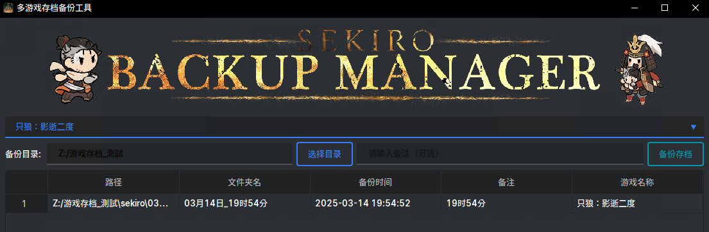

# FromSoftwareSaveManager

一个基于 PyQt6 的存档管理工具，专门用于管理 FromSoftware 游戏的存档文件。




## 功能特性

- 直观的图形用户界面 (GUI)
- 备份和恢复游戏存档
- 自动检测游戏存档位置
- 支持多个存档版本管理
- 自定义备份名称和描述
- 快速切换不同存档
- 支持删除旧备份

## 系统需求

- Python 3.8 或更高版本
- PyQt6
- qt_material

## 安装步骤

1. 克隆本仓库：
   ```bash
   git clone https://github.com/yourusername/FromSoftwareSaveManager.git
   ```
2. 安装依赖：

    ```bash
    pip install -r requirements.txt
    ```

## 使用方法
1. 运行程序：

    ```bash
    python saveManager.py
    ```
2. 主界面将显示当前存档信息和备份列表

3. 使用按钮进行操作：

- "备份"：创建当前存档的备份
- "恢复"：选择并恢复备份
- "删除"：删除选中的备份
- "设置"：配置存档路径和其他选項
