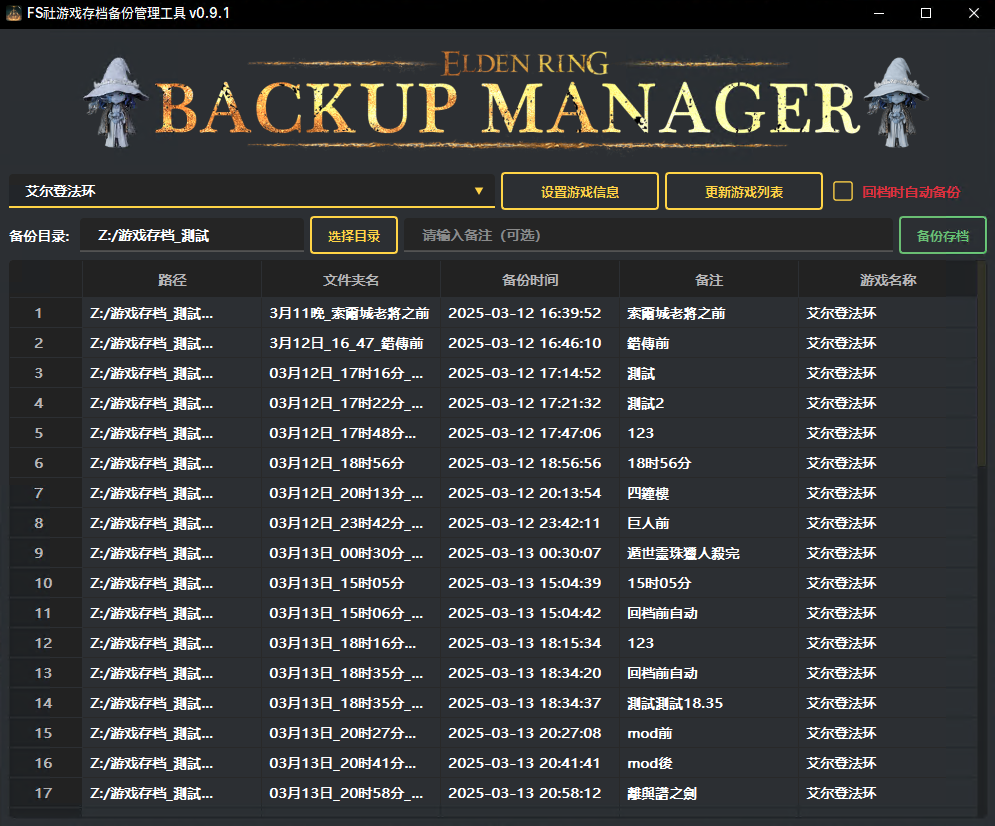

# FromSoftwareSaveManager


一个基于 PyQt6 的存档管理工具，专门用于管理 FromSoftware 游戏的存档文件。（目前也在适配其他有在玩的游戏）

<a href="https://996.icu"></a>
[](https://github.com/996icu/996.ICU/blob/master/LICENSE)




## 功能特性

- 直观的图形用户界面 (GUI)
- 备份和恢复游戏存档
- 支持多个存档版本管理
- 自定义备份名称和描述
- 快速切换不同存档
- 支持删除旧存档备份

## 系统需求

- Python 3.8 或更高版本
- PyQt6
- qt_material

## 安装步骤（从代码运行）

1. 克隆本仓库：
   ```bash
   git clone https://github.com/Kleistr/FromSoftwareSaveManager.git
   ```
2. 安装依赖：

    ```bash
    pip install -r requirements.txt
    ```

## 使用方法
1. 运行程序：

    ```bash
    python saveManager.py
    ```
2. 主界面将显示当前存档信息和备份列表

3. 使用按钮进行操作：

- "备份"：创建当前存档的备份
- "备注"：创建存档时添加备注（如："某boss房前"）
- "回档"：选择并恢复备份
- "删除"：删除选中的备份
- "设置"：配置存档路径和其他选項

## 安装步骤（直接下載exe）

下載 [FromSoftwareSaveManager](https://github.com/Kleistr/FromSoftwareSaveManager/releases)

开箱即用