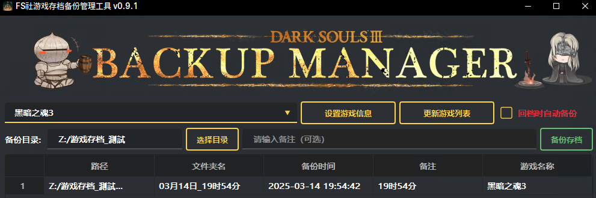

# FromSoftwareSaveManager

一個基於 PyQt6 的存檔管理工具，專門用於管理 FromSoftware 遊戲的存檔文件。





## 功能特性

- 直觀的圖形用戶界面 (GUI)
- 備份和恢復遊戲存檔
- 自動檢測遊戲存檔位置
- 支持多個存檔版本管理
- 自定義備份名稱和描述
- 快速切換不同存檔
- 支持刪除舊備份

## 系統需求

- Python 3.8 或更高版本
- PyQt6
- qt_material

## 安裝步驟

1. 克隆本倉庫：
   ```bash
   git clone https://github.com/yourusername/FromSoftwareSaveManager.git
   ```
2. 安裝依賴：

    ```bash
    pip install -r requirements.txt
    ```

## 使用方法
1. 運行程序：

    ```bash
    python saveManager.py
    ```
2. 主界面將顯示當前存檔信息和備份列表

3. 使用按鈕進行操作：

- "備份"：創建當前存檔的備份
- "恢復"：選擇並恢復備份
- "刪除"：刪除選中的備份
- "設置"：配置存檔路徑和其他選項
