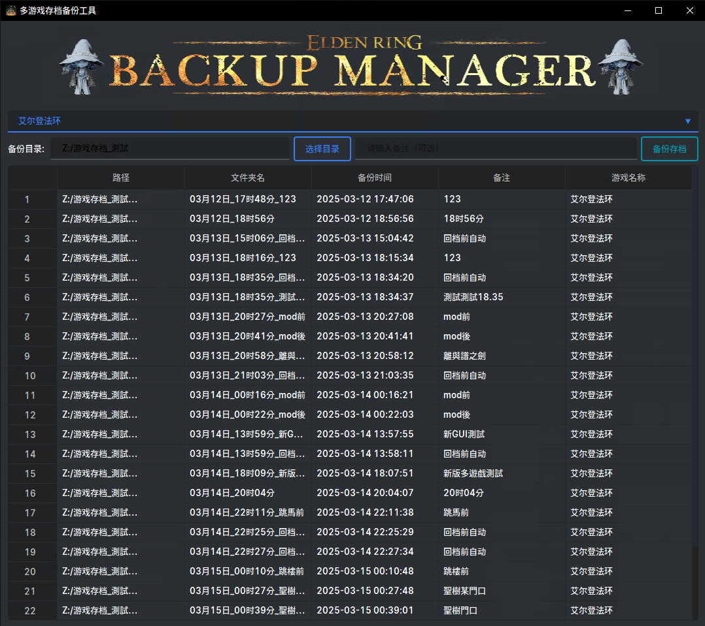
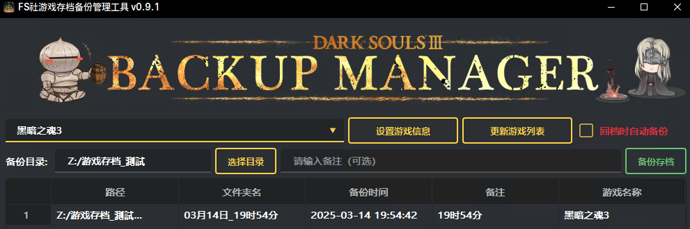
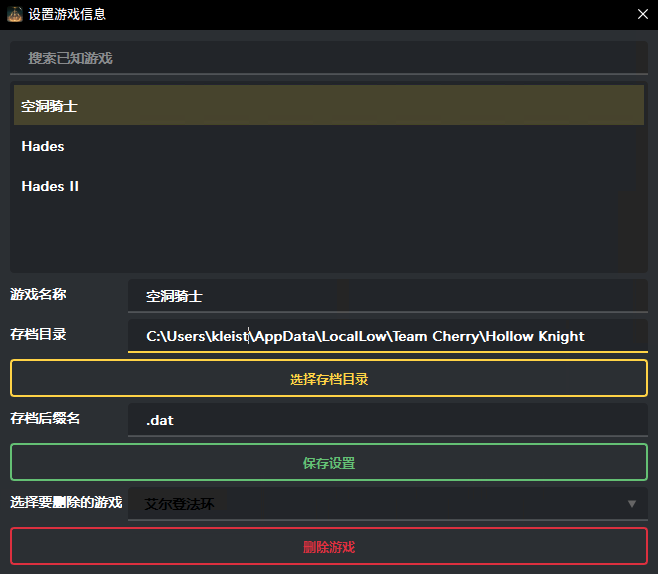

# FromSoftwareSaveManager


一個基於 PyQt6 的存檔管理工具，專門用於管理 FromSoftware 遊戲的存檔檔案。（目前也在適配其他有在玩的遊戲）

<div align="center">


<a href="https://996.icu"></a>
[](https://github.com/996icu/996.ICU/blob/master/LICENSE)
</div>





## 功能特性

- 直觀的圖形使用者介面 (GUI)
- 備份和恢復遊戲存檔
- 支援多個存檔版本管理
- 自定義備份名稱和描述
- 快速切換不同存檔
- 支援刪除舊存檔備份

## 系統需求

- Python 3.8 或更高版本
- PyQt6
- qt_material

## 安裝步驟（從程式碼執行）

1. 克隆本倉庫：
   ```bash
   git clone https://github.com/Kleistr/FromSoftwareSaveManager.git
   ```
2. 安裝依賴：

    ```bash
    pip install -r requirements.txt
    ```

## 使用方法
1. 執行程式：

    ```bash
    saveManager.py
    ```
2. 主介面將顯示當前存檔資訊和備份列表

3. 使用按鈕進行操作：

- "備份"：建立當前存檔的備份
- "備註"：建立存檔時新增備註（如："某boss房前"）
- "回檔"：選擇並恢復備份
- "刪除"：刪除選中的備份
- "設定"：配置存檔路徑和其他選項

## 安裝步驟（直接下載exe）

下載 [FromSoftwareSaveManager](https://github.com/Kleistr/FromSoftwareSaveManager/releases)

開箱即用